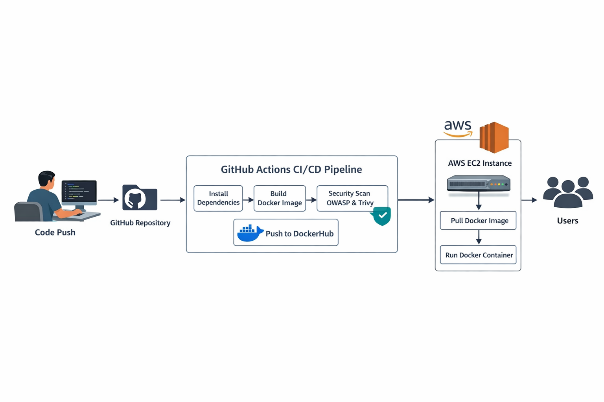

# 🍽️ Zomato Clone Project (DevOps Enabled)

A full-stack **Zomato-inspired web application** with integrated **CI/CD pipeline, Docker containerization, and security scanning (DevOps)**.

This project demonstrates real-world deployment practices using modern DevOps tools like **GitHub Actions, Docker, and Trivy**.

---

## 🏗️ Architecture Diagram



---

## 🚀 Features

* 🔍 Browse restaurants & food items
* 🛒 Add to cart functionality
* 📦 Order management system
* 🖥️ Responsive UI
* 🐳 Dockerized application
* 🔄 Automated CI/CD pipeline
* 🔐 Security scanning using Trivy

---

## 🏗️ Tech Stack

### 🌐 Frontend

* HTML, CSS, JavaScript

### ⚙️ Backend

* (Update this based on your project — Django / Node.js / etc.)


### ⚙️ DevOps Tools

* GitHub Actions (CI/CD)
* Docker (Containerization)
* Trivy (Security Scanning)

---

## 📁 Project Structure

```
Zomato-clone-project/
│
├── frontend/              # UI files
├── backend/               # Application logic
├── Dockerfile             # Docker build instructions
├── .github/workflows/     # CI/CD pipeline
├── trivy.txt              # Security scan report
└── README.md
```

---

## ⚙️ Installation & Setup

### 🔹 Clone the Repository

```bash
git clone https://github.com/PriyeshPandey07/Zomato-clone-project.git
cd Zomato-clone-project
```

---

### 🔹 Run Locally

```bash
# Install dependencies (update as per your backend)
npm install
# or
pip install -r requirements.txt

# Start application
npm start
# or
python manage.py runserver
```

---

### 🐳 Run with Docker

```bash
# Build Image
docker build -t zomato-app .

# Run Container
docker run -d -p 3000:3000 zomato-app
```

---

## 🔄 CI/CD Pipeline (GitHub Actions)

The pipeline automates:

✔️ Code checkout
✔️ Docker image build
✔️ Image push to DockerHub
✔️ Security scan using Trivy

### 📌 Workflow Location

```
.github/workflows/main.yml
```

---

## 🔐 Security Scanning (Trivy)

The project uses **Trivy** to scan Docker images for vulnerabilities.

```bash
trivy image zomato-app:latest > trivy.txt
```

📄 Output is stored in:

```
trivy.txt
```

---

**🚀 CI/CD with Jenkins**

This project also supports Jenkins for enterprise-grade CI/CD automation.

⚙️ Jenkins Pipeline Stages
1. Checkout Code from GitHub
2. Install Dependencies
3. Build Application
4. Build Docker Image
5. Security Scan (Trivy)
6. Push Image to DockerHub
7. Deploy on AWS EC2

### 📌 Pipeline Location

```
Jenkinsfile/Jenkinsfile
```

---

## 🚀 Deployment

You can deploy this project on:

* AWS EC2
* Docker containers
* Kubernetes (future enhancement)

---

## 📈 Future Enhancements

* 🔐 User authentication (JWT / OAuth)
* 💳 Payment integration
* 📊 Admin dashboard
* ☸️ Kubernetes deployment
* 🌍 Domain + HTTPS setup

---

## 🤝 Contributing

Contributions are welcome!

1. Fork the repository
2. Create a new branch
3. Commit your changes
4. Push and create a PR

---

## 📜 License

This project is licensed under the MIT License.

---

## 👨‍💻 Author

**Priyesh Pandey**
DevOps & Cloud Enthusiast 🚀

---

## ⭐ Show Your Support

If you like this project, give it a ⭐ on GitHub!

---
